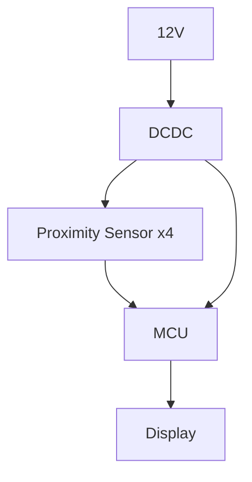
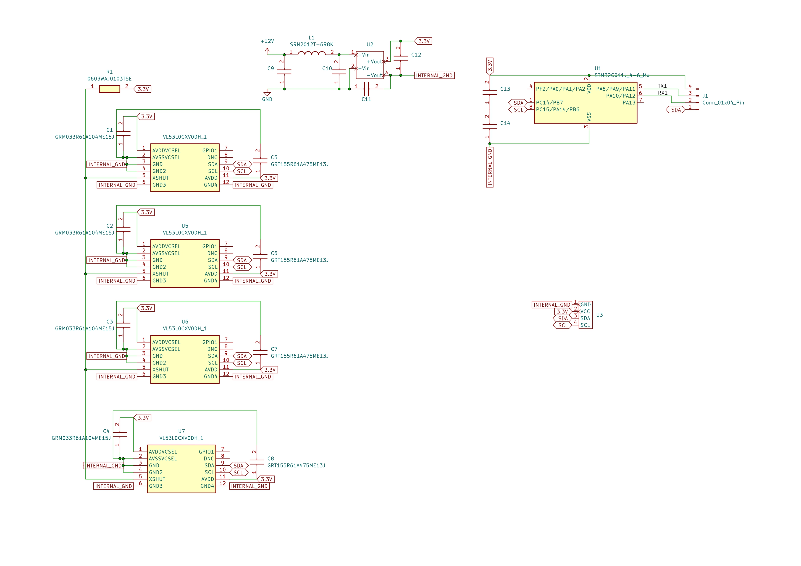
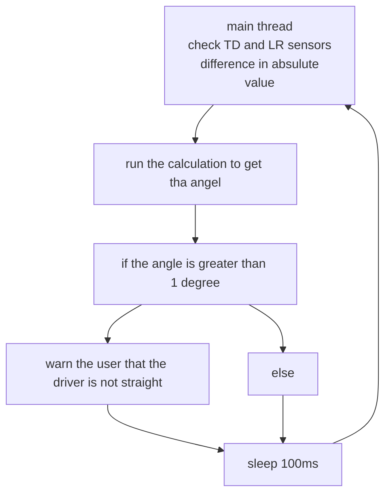

# Documentation

## System Block Diagram

## BOM

| Item | Qty | Reference(s)        | Value              | LibPart                               | Footprint                                                  | Datasheet                                                                                                                                                                     | DNP | Height | Manufacturer_Name  | Manufacturer_Part_Number | Mouser Part Number   | Mouser Price/Stock                                                                                               |
|:-----|:----|:--------------------|:-------------------|:--------------------------------------|:-----------------------------------------------------------|:------------------------------------------------------------------------------------------------------------------------------------------------------------------------------|:----|:-------|:-------------------|:-------------------------|:---------------------|:-----------------------------------------------------------------------------------------------------------------|
|    2 |   5 | C5, C6, C7, C8, C14 | GRT155R61A475ME13J | GRT155R61A475ME13J:GRT155R61A475ME13J | CAPC1005X55N                                               | https://psearch.en.murata.com/capacitor/product/GRT155R61A475ME13%23.html                                                                                                     |     |   0.55 | Murata Electronics | GRT155R61A475ME13J       | 81-GRT155R61A475ME3J | https://www.mouser.co.uk/ProductDetail/Murata-Electronics/GRT155R61A475ME13J?qs=d0WKAl%252BL4KaEVeQobahv9g%3D%3D |
|    3 |   1 | C11                 | C0402C271K5RAC     | C0402C271K5RAC:C0402C271K5RAC         | CAPC1005X55N                                               | https://content.kemet.com/datasheets/KEM_C1002_X7R_SMD.pdf                                                                                                                    |     |   0.55 | KEMET              | C0402C271K5RAC           |    80-C0402C271K5RAC | https://www.mouser.co.uk/ProductDetail/KEMET/C0402C271K5RAC?qs=cr8T4Ugre45g%252BE5NGMDJuA%3D%3D                  |
|    4 |   1 | C12                 | GRM188R61C106MA73J | GRM188R61C106MA73J:GRM188R61C106MA73J | CAPC1608X90N                                               | http://componentsearchengine.com/Datasheets/1/GRM188R61C106MA73J.pdf                                                                                                          |     |    0.9 | Murata Electronics | GRM188R61C106MA73J       | 81-GRM188R61C106MA3J | https://www.mouser.co.uk/ProductDetail/Murata-Electronics/GRM188R61C106MA73J?qs=QzBtWTOodeVxskQb7yWr5w%3D%3D     |
|    5 |   1 | J1                  | Conn_01x04_Pin     | Connector:Conn_01x04_Pin              | Connector_PinSocket_1.00mm:PinSocket_1x04_P1.00mm_Vertical | ~                                                                                                                                                                             |     |        |                    |                          |                      |                                                                                                                  |
|    6 |   1 | L1                  | SRN2012T-6R8K      | SRN2012T-6R8K:SRN2012T-6R8K           | INDPM2012X120N                                             | http://www.bourns.com/docs/Product-Datasheets/SRN2012T.pdf                                                                                                                    |     |    1.2 | Bourns             | SRN2012T-6R8K            |    652-SRN2012T-6R8K | https://www.mouser.co.uk/ProductDetail/Bourns/SRN2012T-6R8K?qs=A6eO%252BMLsxmSuOZAvAVKYXQ%3D%3D                  |
|    7 |   1 | R1                  |     0603WAJ0103T5E |         0603WAJ0103T5E:0603WAJ0103T5E | RESC1608X55N                                               |                                                                                                                                                                               |     |   0.55 | ROYALOHM           |           0603WAJ0103T5E |   303-0603WAJ0103T5E | https://www.mouser.co.uk/ProductDetail/Royalohm/0603WAJ0103T5E?qs=e8oIoAS2J1RbD%2Fl9RKhEzg%3D%3D                 |
|    8 |   1 | U1                  | STM32C011J_4-6_Mx  | MCU_ST_STM32C0:STM32C011J_4-6_Mx      | Package_SO:SOIC-8_3.9x4.9mm_P1.27mm                        | https://www.st.com/resource/en/datasheet/stm32c011j4.pdf                                                                                                                      |     |        |                    |                          |                      | https://eu.mouser.com/ProductDetail/STMicroelectronics/STM32C011J4M6?qs=sGAEpiMZZMuI9neUTtPr757IDD%2FwidVO9Y8NJtJxmQ7%252BtRyaW90qJw%3D%3D|
|    9 |   1 | U2                  | ~                  | Converter_DCDC:IEB0112S3V3            | Converter_DCDC:IEB01                                       |                                                                                                                                                                               |     |        |                    |                          |                      |                                                                                                                  |
|   10 |   1 | U3                  | ~                  | Driver_Display:SSD1306                | Connector_PinSocket_1.00mm:PinSocket_1x04_P1.00mm_Vertical |                                                                                                                                                                               |     |        |                    |                          |                      |                                                                                                                  |
|   11 |   4 | U4, U5, U6, U7      | VL53L0CXV0DH_1     | VL53L0CXV0DH_1:VL53L0CXV0DH_1         | KiCad:LGA12_1                                              | http://www.st.com/content/ccc/resource/technical/document/datasheet/group3/b2/1e/33/77/c6/92/47/6b/DM00279086/files/DM00279086.pdf/jcr:content/translations/en.DM00279086.pdf |     |        | STMicroelectronics | VL53L0CXV0DH/1           |   511-VL53L0CXV0DH/1 | https://www.mouser.co.uk/ProductDetail/STMicroelectronics/VL53L0CXV0DH-1?qs=dTJS0cRn7ojtsK3C9%252BTaSw%3D%3D     |  

4x2.32 + 1x0.493 + 1x0.001 + 1x0.068 + 1x0.034 + 1x0.05 + 5x0.02 + 1x64.10 + development = 74.126  + development = 89.99 EUR
## Schematic

## Calculations

We calculated the distance of the head fron the screw, and the angle using only 2 of the sensors.
  
The formulas we came up with:
$$d_0 = \frac{D_{s1} +d_{s2}}{2}, \alpha = \tan\left(|{d_{s1}-d_s2}|\right)$$

These of course work with any of the opposing sensors to get the anglo of the given axis.

## Working Priciple

With the TOF sensors we get the distance difference, and use that to calculate the angle in the given axis.

The TOF has a range from 5cm to 120cm being more than enough for our purposes.

## Firmware Block Diagram

## Business Model

We ainly focus one beginners and completely stangers to the given tool. Ris way we can bring many new customers, while also providing them and older customers quality features.