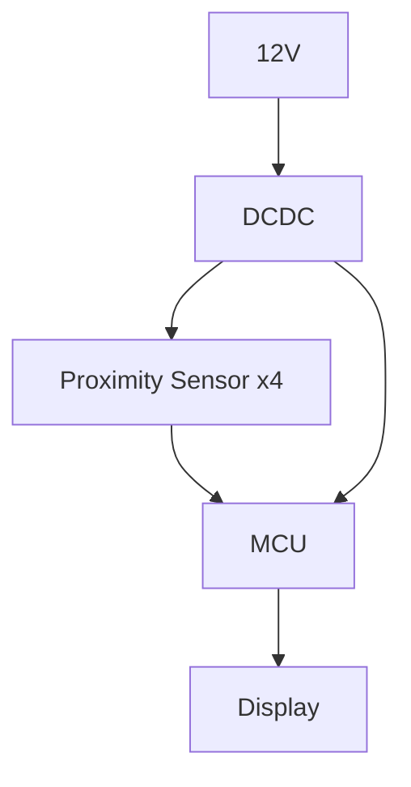
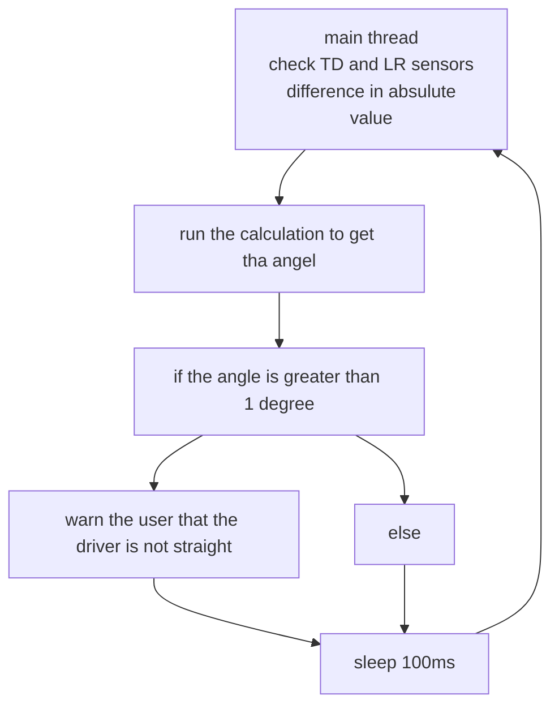

# Documentation

## System Block Diagram

## BOM

## Schematic

## Calculations

We calculated the distance of the head fron the screw, and the angle using only 2 of the sensors.
  
The formulas we came up with:
$$d_0 = \frac{D_{s1} +d_{s2}}{2}, \alpha = \tan\left(|{d_{s1}-d_s2}|\right)$$

These of course work with any of the opposing sensors to get the anglo of the given axis.

## Working Priciple

With the TOF sensors we get the distance difference, and use that to calculate the angle in the given axis.

The TOF has a range from 5cm to 120cm being more than enough for our purposes.

## Firmware Block Diagram

## Business Model

We ainly focus one beginners and completely stangers to the given tool. Ris way we can bring many new customers, while also providing them and older customers quality features.