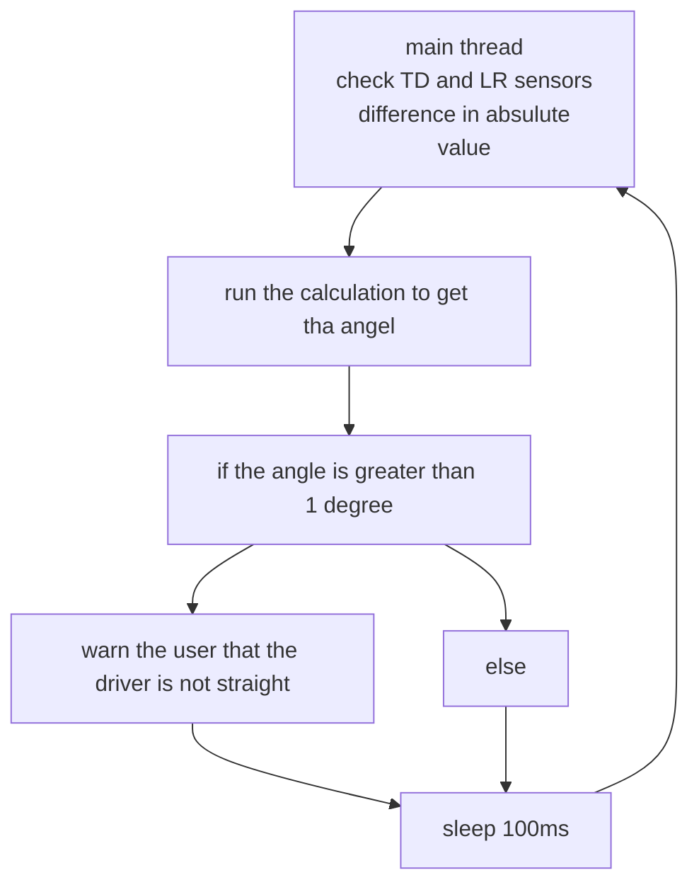

```mermaid
graph TD
    phase1["`main thread
    check TD and LR sensors 
    difference in absulute 
    value`"] --> phase2["run the calculation to get tha angel"] --> phase3["if the angle is greater than 1 degree"] --> phase4["warn the user that the driver is not straight "] --> phase6["sleep 100ms"] --> phase1
    phase3 --> phase5["else"] --> phase6
```